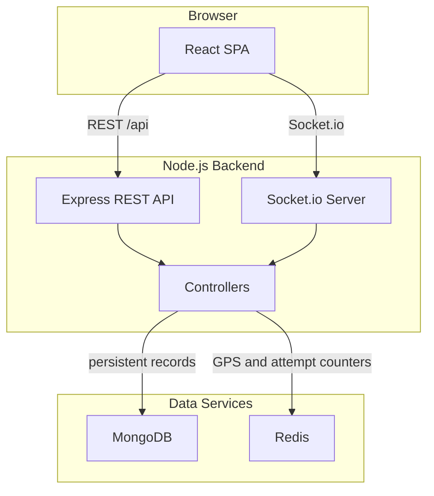

# Digital tRAT Test System

> A real-time digital team readiness assurance test system for large first-year engineering classes.

This project focuses on the digital tRAT gap in Team-Based Learning. It does not implement iRAT. The system supports teacher-controlled live questions, student-created teams, GPS check-in, team leader answer submission, immediate attempt feedback, post-test feedback, and result export.

## At A Glance

| Area | Implementation |
| --- | --- |
| Teaching scope | tRAT only |
| Frontend | React 18, Vite, React Router, Axios, Socket.io Client |
| Backend | Node.js 18, Express, Socket.io, Mongoose, JWT, Multer, XLSX |
| Persistent storage | MongoDB 6.0 |
| Live state | Redis 7.0 |
| Development | Docker Compose |
| Production | Docker Compose, Nginx, Caddy |

## Core Workflow

```mermaid
flowchart LR
    A["Teacher imports roster"] --> B["Teacher imports tRAT test"]
    B --> C["Students log in"]
    C --> D["Students create teams"]
    D --> E["Teacher sets GPS point"]
    E --> F["Students check in"]
    F --> G["Teacher publishes test"]
    G --> H["Leader device submits team answers"]
    H --> I["Teacher changes question"]
    I --> H
    I --> J["Teacher ends test"]
    J --> K["Students submit feedback"]
    K --> L["Teacher reviews and exports results"]
```



## Feature Summary

### Teacher Portal

| Feature | Current behaviour |
| --- | --- |
| Teacher login | Uses account and password from environment variables |
| Classroom GPS | Saves teacher browser GPS point to Redis with a timestamp |
| Roster import | Accepts Excel or CSV files with `Name` and `UPI` columns |
| Student accounts | Generates student emails as `UPI@aucklanduni.ac.nz` |
| Passwords | Generates passwords and keeps existing passwords for unchanged UPIs |
| Email delivery | Sends password emails through configured SMTP settings |
| Test import | Accepts Excel or CSV files with `Seq`, `OptionA`, `OptionB`, `OptionC`, `OptionD`, and `CorrectAnswer` |
| Live control | Publishes one test, moves all teams to the next question, and closes the test at the end |
| Reporting | Shows check-in counts, team scores, question performance, and feedback |
| Export | Downloads student results as an `.xlsx` file |

### Student Portal

| Feature | Current behaviour |
| --- | --- |
| Student login | Uses UPI and generated password |
| Team creation | One student enters 2 or 3 teammates' UPIs and passwords |
| Team size | 3 or 4 students including the creator |
| Team leader | The team creator becomes the leader |
| GPS check-in | Passes when the student is within 500 metres of the teacher GPS point |
| GPS expiry | Teacher GPS point expires after 15 minutes |
| Live answering | Only the team leader device can submit answers |
| Member devices | Show a message telling students to share the leader device |
| Attempts | Teams get up to 3 attempts per question |
| Scoring | 3 points on first try, 2 points on second try, 1 point on third try |
| Feedback | Open for 10 minutes after the test closes |

## Architecture



The frontend is a React single-page application. It handles pages, navigation, local UI state, and user interaction. It does not decide answer correctness or scores.

The backend is the source of truth. It handles authentication, imports, team creation, GPS check-in, question delivery, answer marking, scoring, feedback, statistics, and export.

Socket.io is used for live notification. Detailed state is still fetched through REST APIs, so the backend remains the authority for the current test state.

## Data Model

| Model | Purpose | Main fields |
| --- | --- | --- |
| `User` | Teacher and student accounts | `role`, `upi`, `name`, `email`, `password`, `teamId` |
| `Team` | Active or historical team records | `teamName`, `testId`, `leaderId`, `members`, `isActive` |
| `Test` | tRAT test definition and state | `name`, `status`, `scoringRules`, `questions`, `currentQuestionSeq`, `feedbackOpenUntil` |
| `CheckIn` | Student GPS result for a test | `testId`, `studentId`, `status`, `distanceMeters`, `checkedAt` |
| `Result` | Team score, answers, attendance, and feedback | `testId`, `teamId`, `activeStudentId`, `totalScore`, `answers`, `feedback`, `presentMembers` |

Redis stores short-lived live state:

| Redis key | Purpose |
| --- | --- |
| `teacher:gps` | Teacher latitude, longitude, and timestamp |
| `test:<testId>:team:<teamId>:q:<seq>:attempts` | Attempt count for one team on one question |

## API Overview

### Authentication

| Method | Path | Purpose |
| --- | --- | --- |
| `POST` | `/api/auth/teacher/login` | Teacher login |
| `POST` | `/api/auth/student/login` | Student login |

### Teacher

| Method | Path | Purpose |
| --- | --- | --- |
| `POST` | `/api/teacher/gps` | Save classroom GPS point |
| `GET` | `/api/teams/students` | List imported students |
| `POST` | `/api/teams/import` | Import student roster |
| `DELETE` | `/api/teams/students` | Clear student roster |
| `POST` | `/api/teams/send-password-emails` | Email student passwords |
| `POST` | `/api/tests/import` | Import tRAT test |
| `GET` | `/api/tests` | List tests |
| `GET` | `/api/tests/:testId` | Get test detail |
| `POST` | `/api/tests/:testId/publish` | Publish test |
| `POST` | `/api/tests/:testId/next` | Move to next question or end test |
| `POST` | `/api/tests/:testId/close` | Close test |
| `GET` | `/api/tests/:testId/statistics` | Get statistics |
| `GET` | `/api/tests/:testId/export` | Export results |
| `DELETE` | `/api/tests/:testId` | Delete draft or closed test |

### Student

| Method | Path | Purpose |
| --- | --- | --- |
| `GET` | `/api/student/lobby` | Get lobby, team, check-in, live test, and feedback state |
| `GET` | `/api/student/team-info` | Get active team |
| `POST` | `/api/student/team` | Create team |
| `POST` | `/api/student/ready` | GPS check-in |
| `GET` | `/api/student/question` | Get current team question |
| `POST` | `/api/student/answer` | Submit answer attempt |
| `POST` | `/api/student/feedback` | Submit post-test feedback |

## Socket Events

### Client Join Events

| Event | Purpose |
| --- | --- |
| `teacher_join` | Join `teacher_room` |
| `join_user` | Join `user_<studentId>` |
| `join_team` | Join `team_<teamId>` |
| `JOIN_TEAM_ROOM` | Alternate team-room join event |

### Server Broadcast Events

| Event | Purpose |
| --- | --- |
| `TEAM_UPDATED` | Team was created or updated |
| `TEST_STARTED` | Teacher published a test |
| `CHANGE_QUESTION` | Teacher moved the class to the next question |
| `TEST_ENDED` | Test was closed |
| `NEW_FEEDBACK_RECEIVED` | Teacher received new student feedback |

## Local Development

Create `backend/.env` first:

```env
PORT=5000
MONGO_URI=mongodb://mongo:27017/test_system
REDIS_URL=redis://redis:6379
JWT_SECRET=replace-with-a-long-random-secret

TEACHER_EMAIL=teacher@example.com
TEACHER_PASSWORD=replace-with-teacher-password

EMAIL_HOST=smtp.qq.com
EMAIL_PORT=465
EMAIL_SECURE=true
EMAIL_USER=your-sender@example.com
EMAIL_PASS=replace-with-smtp-authorization-code
EMAIL_FROM=TBL Test System <your-sender@example.com>
```

Start the development stack:

```bash
docker compose up --build
```

Development services:

| Service | URL |
| --- | --- |
| Frontend | `http://localhost:5173` |
| Backend health check | `http://localhost:5000/api/ping` |
| MongoDB | `localhost:27017` |
| Redis | `localhost:6379` |

## Production Deployment

Production uses `docker-compose.prod.yml`.

| Service | Role |
| --- | --- |
| `caddy` | Public entry point, HTTPS, compression, reverse proxy |
| `frontend` | Vite build served by Nginx |
| `backend` | Express and Socket.io server |
| `mongo` | Persistent database |
| `redis` | Live state store |

Caddy proxies:

| Public path | Target |
| --- | --- |
| `/api/*` | `backend:5000` |
| `/socket.io/*` | `backend:5000` |
| all other paths | `frontend:80` |

Manual production deployment can be done on the server with Docker Compose:

```bash
docker compose -f docker-compose.prod.yml build
docker compose -f docker-compose.prod.yml up -d --remove-orphans
```

The server must provide a production environment file with values such as `JWT_SECRET`, `APP_HOST`, teacher credentials, and email settings.

## Project Structure

```text
.
├── backend
│   ├── index.js
│   └── src
│       ├── config
│       ├── controllers
│       ├── middlewares
│       ├── models
│       ├── routes
│       ├── services
│       ├── sockets
│       └── utils
├── frontend
│   ├── index.html
│   ├── nginx.conf
│   └── src
│       ├── api
│       ├── components
│       ├── config
│       ├── context
│       ├── hooks
│       └── pages
├── scripts
├── docker-compose.yml
└── docker-compose.prod.yml
```

## Current Scope

This project implements the team test part of TBL. It is a tRAT-focused system.
The current answer authority is based on the team leader device.
